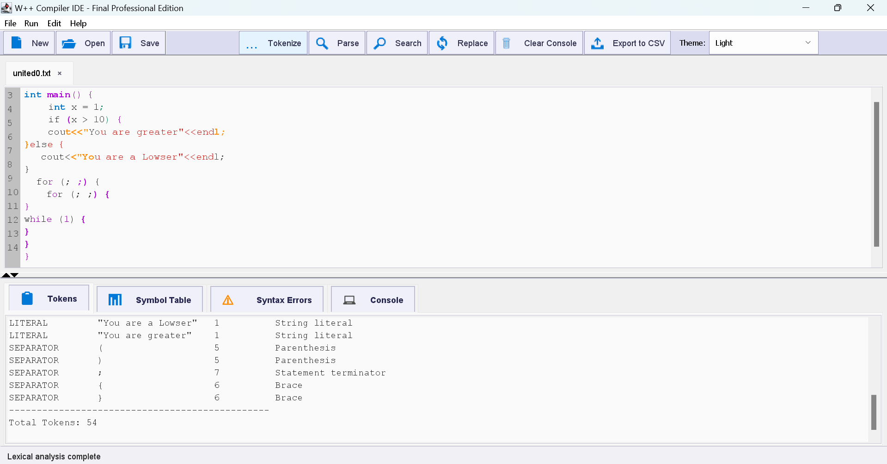

# cpp-lexical-analyzer

A Java-based C/C++ lexical analyzer and syntax highlighter with a modern GUI. Features include tokenization, symbol table generation, error detection, and real-time error highlighting. Ideal for compiler design projects and educational use.


## Features

- Tokenization of C/C++ source code
- Lexical and syntax error detection with line/column reporting
- Symbol table generation with type and size info
- Real-time syntax highlighting and error marking in GUI
- Tabbed editor, dark/light themes, line numbers, find/replace
- Export analysis results to file

## Application GUI

<p align="center">
  
</p>
<p align="center"><em>The W++ Compiler IDE features a modern, tabbed interface with real-time syntax highlighting, error marking, and token analysis for C++ code. The screenshot below shows the main editor and analysis panels in action.</em></p>

## Requirements

- Java JDK 11 or higher (Java 17+ recommended)
- Windows, Linux, or macOS

## Installation

Clone the repository:
```bash
git clone https://github.com/AdanSultan/cpp-lexical-analyzer.git
cd cpp-lexical-analyzer
```

## Usage

### Run the GUI (Recommended)
1. Compile the GUI:
   ```bash
   javac -cp src/main/java src/main/java/LexerGUI.java
   ```
2. Run the GUI:
   ```bash
   java -cp src/main/java LexerGUI
   ```
   - Use the GUI to open, edit, and analyze C++ files. Errors are highlighted in real-time.

### Run the Command-Line Lexer
1. Compile the lexer:
   ```bash
   javac -cp src/main/java src/main/java/Lexer.java
   ```
2. Run the lexer with an input file:
   ```bash
   java -cp src/main/java Lexer input.txt
   ```
   - Output will be written to `output.txt` in the project root.

## Project Structure

```
cpp-lexical-analyzer/
├── input.txt                 # Sample input file
├── output.txt                # Output generated by the lexer
├── images/
│   └── screenshot1.png       # GUI screenshot for README
├── src/
│   └── main/
│       └── java/
│           ├── Lexer.java       # Command-line lexical analyzer
│           ├── LexerGUI.java    # GUI application
│           ├── IconGenerator.java
│           └── ...              # Other Java source files
├── united0.txt, united1.txt ... # Example/test files created by GUI
├── .gitignore
├── LICENSE
└── README.md
```

## How It Works

### 1. Lexical Analysis
- Scans the input source code character by character and groups them into tokens:
  - **Keywords**: `int`, `float`, `if`, `else`, etc.
  - **Identifiers**: Variable and function names
  - **Operators**: `+`, `-`, `*`, `/`, `=`, etc.
  - **Literals**: String and character literals
  - **Constants**: Numeric values
  - **Separators**: `(`, `)`, `{`, `}`, `;`, etc.

### 2. Syntax Analysis
- Checks for:
  - Bracket matching
  - Semicolon placement
  - Control structure validation

### 3. Symbol Table Generation
- Tracks all declared variables with:
  - Name, data type, size, line of declaration, and simulated memory address

## Token Types

| Token Type | Description | Examples |
|------------|-------------|----------|
| KEYWORD    | Reserved C++ keywords | `int`, `if`, `while`, `return` |
| IDENTIFIER | Variable/function names | `myVar`, `count`, `main` |
| OPERATOR   | Arithmetic/logical operators | `+`, `-`, `==`, `&&` |
| LITERAL    | String/char literals | `"hello"`, `'a'` |
| CONSTANT   | Numeric values | `42`, `3.14`, `100` |
| SEPARATOR  | Punctuation marks | `(`, `)`, `{`, `}`, `;` |
| ERROR      | Invalid tokens | Unrecognized characters |

## Example

### Example Input (`input.txt`)
```cpp
#include <iostream>

int main() {
    int num = 100;
    cout << "Number is: " << num << endl;
    return 0;
}
```

### Example Output
- **Token Table**: List of all tokens with their types and counts
- **Symbol Table**: Variables with types, sizes, and memory addresses
- **Error Report**: Any lexical or syntax errors found

## Contributing

Contributions are welcome! Please feel free to submit a Pull Request.

1. Fork the repository
2. Create your feature branch (`git checkout -b feature/AmazingFeature`)
3. Commit your changes (`git commit -m 'Add some AmazingFeature'`)
4. Push to the branch (`git push origin feature/AmazingFeature`)
5. Open a Pull Request

## License

This project is licensed under the MIT License - see the [LICENSE](LICENSE) file for details.

## Author

**Adan Sultan**
- GitHub: [@AdanSultan](https://github.com/AdanSultan)

## Acknowledgments

- Java Swing for the GUI framework
- Inspired by compiler design principles

---

⭐ **If you found this project helpful, please consider giving it a star!**
