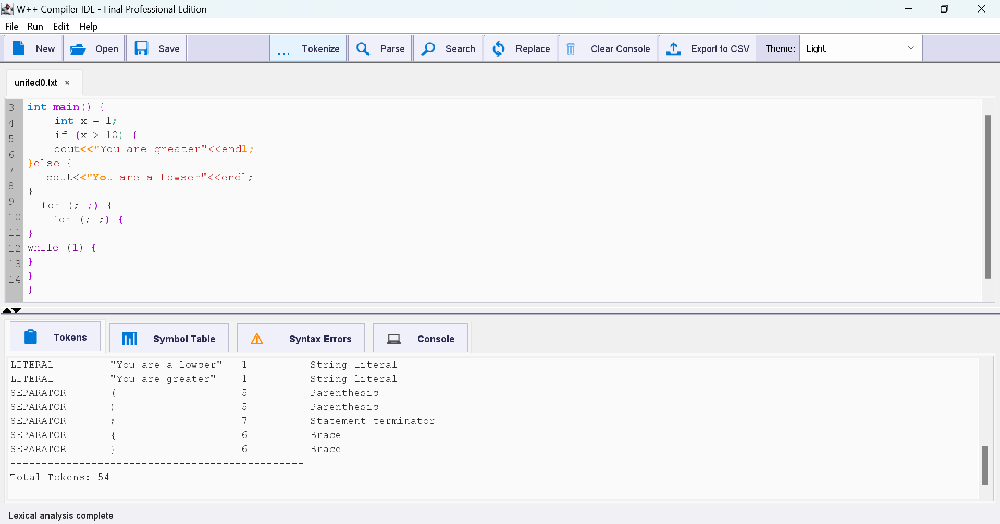

# cpp-lexical-analyzer

A Java-based C/C++ lexical analyzer and syntax highlighter with a modern GUI. Features include tokenization, symbol table generation, error detection, and real-time error highlighting. Ideal for compiler design projects and educational use.


## Features

- Tokenization of C/C++ source code
- Lexical and syntax error detection with line/column reporting
- Symbol table generation with type and size info
- Real-time syntax highlighting and error marking in GUI
- Tabbed editor, dark/light themes, line numbers, find/replace
- Export analysis results to file


## Application GUI

<p align="center">
   
</p>

<p align="center"><em>The W++ Compiler IDE features a modern, tabbed interface with real-time syntax highlighting, error marking, and token analysis for C++ code. The screenshot below shows the main editor and analysis panels in action.</em></p>

## Requirements

- Java JDK 11 or higher (Java 17+ recommended)
- Windows, Linux, or macOS

## Installation

Clone the repository:
```bash
git clone https://github.com/AdanSultan/cpp-lexical-analyzer.git
cd cpp-lexical-analyzer
```

## Usage

### Run the GUI
```bash
javac -cp src/main/java src/main/java/LexerGUI.java
java -cp src/main/java LexerGUI
```

### Run the command-line lexer
```bash
javac -cp src/main/java src/main/java/Lexer.java
java -cp src/main/java Lexer input.txt
```
Output will be written to output.txt in the project root.

## Project Structure

- src/main/java/ : Java source files (Lexer.java, LexerGUI.java, etc.)
- input.txt, output.txt : Example input/output files
- README.md, LICENSE, .gitignore : Project metadata

## License

This project is licensed under the MIT License. See LICENSE for details.

---

*For screenshots, usage examples, and contributing guidelines, see the full documentation in the repository.*

2. **Run the GUI application:**
   ```bash
   java LexerGUI
   ```

### Running the Command-Line Lexer

1. **Compile:**
   ```bash
   javac Lexer.java
   ```

2. **Run with an input file:**
   ```bash
   java Lexer input.txt
   ```

3. **Check the output:**
   - Results are written to `output.txt`

### Example Input

Create a file `input.txt` with C++ code:

```cpp
#include <iostream>

int main() {
    int num = 100;
    cout << "Number is: " << num << endl;
    return 0;
}
```

### Example Output

The analyzer will generate:
- **Token Table** - List of all tokens with their types and counts
- **Symbol Table** - Variables with types, sizes, and memory addresses
- **Error Report** - Any lexical or syntax errors found

## 📁 Project Structure

```
cpp-lexical-analyzer/
├── Lexer.java              # Command-line lexical analyzer
├── LexerGUI.java           # GUI application with full features
├── input.txt               # Sample input file
├── src/
│   └── main/
│       └── resources/
│           ├── fonts/      # Custom fonts (if any)
│           └── icons/      # UI icons
│               ├── new.png
│               ├── open.png
│               ├── save.png
│               ├── tokenize.png
│               ├── parse.png
│               └── ...
├── examples/               # Example C++ files for testing
│   ├── united0.txt
│   ├── united1.txt
│   ├── united2.txt
│   └── united3.txt
├── .gitignore
├── LICENSE
└── README.md
```

## ⚙️ How It Works

### 1. Lexical Analysis Phase
The lexer scans the input source code character by character and groups them into meaningful tokens:

- **Keywords**: `int`, `float`, `double`, `char`, `if`, `else`, `while`, `for`, `return`, `do`, `main`, `cout`, `endl`, etc.
- **Identifiers**: Variable and function names
- **Operators**: `+`, `-`, `*`, `/`, `=`, `==`, `!=`, `<`, `>`, `<=`, `>=`, `&&`, `||`, etc.
- **Literals**: String literals (`"hello"`) and character literals (`'a'`)
- **Constants**: Numeric values (integers and floating-point)
- **Separators**: `(`, `)`, `{`, `}`, `[`, `]`, `;`, `,`, `#`

### 2. Syntax Analysis Phase
Basic syntax validation including:
- Bracket matching (`{`, `}`, `(`, `)`, `[`, `]`)
- Semicolon placement
- Control structure validation

### 3. Symbol Table Generation
Tracks all declared variables with:
- Name
- Data type
- Size in bytes
- Line of declaration
- Memory address (simulated)

## 📊 Token Types

| Token Type | Description | Examples |
|------------|-------------|----------|
| KEYWORD | Reserved C++ keywords | `int`, `if`, `while`, `return` |
| IDENTIFIER | Variable/function names | `myVar`, `count`, `main` |
| OPERATOR | Arithmetic/logical operators | `+`, `-`, `==`, `&&` |
| LITERAL | String/char literals | `"hello"`, `'a'` |
| CONSTANT | Numeric values | `42`, `3.14`, `100` |
| SEPARATOR | Punctuation marks | `(`, `)`, `{`, `}`, `;` |
| ERROR | Invalid tokens | Unrecognized characters |

## 🤝 Contributing

Contributions are welcome! Please feel free to submit a Pull Request.

1. Fork the repository
2. Create your feature branch (`git checkout -b feature/AmazingFeature`)
3. Commit your changes (`git commit -m 'Add some AmazingFeature'`)
4. Push to the branch (`git push origin feature/AmazingFeature`)
5. Open a Pull Request

## 📄 License

This project is licensed under the MIT License - see the [LICENSE](LICENSE) file for details.

## 👤 Author

**Your Name**
- GitHub: [@YOUR_USERNAME](https://github.com/YOUR_USERNAME)

## 🙏 Acknowledgments

- Java Swing for the GUI framework
- Inspired by compiler design principles

---

⭐ **If you found this project helpful, please consider giving it a star!**
